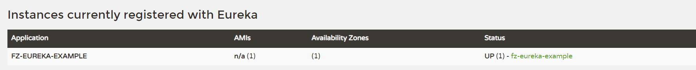
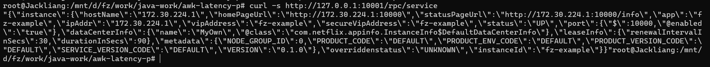

# Aegle-go

希腊语Αἴγλη, Aiglê   拉丁化之后单词为， Aegle   意“光辉”、“日光”、“焕发光彩”

## Previously 
[design doc](https://nunoku5xpw.feishu.cn/wiki/EfNiw1pRFi4phXkTN57cP3gcn9f)
## Description
This is a client SDK, which is the go version of eureka-client. It is used to interact with Eureka services and make point-to-point RPC calls from machines.


## Features

* Heartbeat
* Refresh（Only all applications）
* Support common load balancing algorithms
* Support server-side timeout protection
* Support request service name RPC
* Support backoff retry algorithms

## Todo

* ~~Re-Register~~

* Refresh by delta

If the delta is disabled or if it is the first time, get all applications

## Example

```go
	client := SpawnClient(func(cfg *Config) {
cfg.DefaultZone = "http://localhost:8761/eureka/"
cfg.InstanceID = "aegle-eureka-example"
cfg.App = "aegle-eureka-example"
cfg.Port = 10000
cfg.RenewalIntervalInSecs = 10
cfg.RegistryFetchIntervalSeconds = 15
cfg.DurationInSecs = 30
cfg.Metadata = map[string]interface{}{
"VERSION":              "0.1.0",
"NODE_GROUP_ID":        0,
"PRODUCT_CODE":         "DEFAULT",
"PRODUCT_VERSION_CODE": "DEFAULT",
"PRODUCT_ENV_CODE":     "DEFAULT",
"SERVICE_VERSION_CODE": "DEFAULT",
}
})

go func() {
// http server
http.HandleFunc("/v1/services", func(writer http.ResponseWriter, request *http.Request) {
// full applications from eureka server
apps := "{\"instance\":{\"hostName\":\"172.30.224.1\",\"homePageUrl\":\"http://172.30.224.1:10000\",\"statusPageUrl\":\"http://172.30.224.1:10000/info\",\"app\":\"aegle-example\",\"ipAddr\":\"172.30.224.1\",\"vipAddress\":\"aegle-example\",\"secureVipAddress\":\"aegle-example\",\"status\":\"UP\",\"port\":{\"$\":10000,\"@enabled\":\"true\"},\"dataCenterInfo\":{\"name\":\"MyOwn\",\"@class\":\"com.netflix.appinfo.InstanceInfo$DefaultDataCenterInfo\"},\"leaseInfo\":{\"renewalIntervalInSecs\":30,\"durationInSecs\":90},\"metadata\":{\"NODE_GROUP_ID\":0,\"PRODUCT_CODE\":\"DEFAULT\",\"PRODUCT_ENV_CODE\":\"DEFAULT\",\"PRODUCT_VERSION_CODE\":\"DEFAULT\",\"SERVICE_VERSION_CODE\":\"DEFAULT\",\"VERSION\":\"0.1.0\"},\"overriddenstatus\":\"UNKNOWN\",\"instanceId\":\"aegle-example\"}}"

b, _ := json.Marshal(apps)
_, _ = writer.Write(b)
})

// start http server
if err := http.ListenAndServe(":10000", nil); err != nil {
fmt.Println(err)
}
}()

time.Sleep(3 * time.Second)

// http server
http.HandleFunc("/rpc/service", func(writer http.ResponseWriter, request *http.Request) {
// full applications from eureka server
withJson, err := client.restRpcWithJson(context.TODO(), "http://aegle-eureka-example/v1/services", "POST")

if err != nil {
fmt.Println(err)
}

_, _ = writer.Write([]byte(withJson))
})

// start http server
if err := http.ListenAndServe(":10001", nil); err != nil {
fmt.Println(err)
}
```


## Test

### roundRobin
[randomrobin_test.go](randomrobin_test.go)
### randomRobin
[roundrobin_test.go](roundrobin_test.go)


##Eureka-java-serv

I use `spring-cloud-starter-netflix-eureka-server` in Java.
[Eureka-java](./eureka-aegle)

### 测试
1. 启动Eureka-server 
> 
2. 运行 [main](./doc/./main.go) 方法
```go
......
withJson, err := client.restRpcWithJson(context.TODO(), "http://aegle-eureka-example/v1/services", "POST") 
......
```
3. 访问

> 由10001端口转发到10000端口发起RPC 返回结果